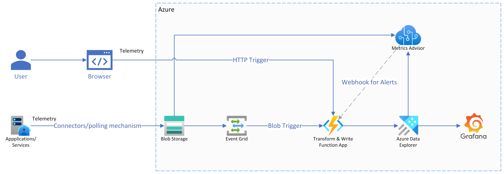

# Overview

This Repo contains a sample application building real-time monitoring and observability systems for media

## Architecture



### Folder Structure Overview

```bash
├── RealTimeMonitoringForMedia
│   ├── docs - "Contains all the docs for step by step guide"
│   ├── functions
│   │   ├── blob_storage_trigger - "Azure Function App triggered by blob event which transforms the data from blob to ADX"
│   │   │
│   │   ├── event_grid_trigger - "Azure Event Grid trigger function that listens the blob event and triggers the blob storage trigger function"
│   │   │
│   │   ├── http_trigger - "Azure function app that handles the http triggers, gets the data from http trigger and transforms the data to ADX"
│   │   │
│   │   ├── shared - "Contains ADX client, Metrics Advisor client, and data transformation handler code"
│   │   │   ├── kusto_service_client.py
│   │   │   ├── metrics_advisor_client.py
│   │   │   ├── transform_handler.py
│   │   ├── tests - "Contains all the tests codes to check the functionality of setup"
│   │   │
│   │   ├── transformations - "General transformation code and sample transformation code for slow start table"
│   │   │
│   │   ├── utils - "Codes to setup the local environment variables"
│   |   ├── local.settings.json
│   |   ├── requirements.txt
│   ├── IaC - "Bicep infrastructure code to deploy azure resources"
│   ├── azure-pipelines.yml - "Azure pipeline for linting and testing the source code"
│   ├── mega-linter.yml - "Megalinter configuration file"
│   ├── azure-deploy-pipeline.yml - "Pipeline for deploying the required Azure resources"
 ── ├── Readme.md
```

### Step by Step Guide

1. First we need to deploy all the required resources to Azure. Azure infrastructure code is written in bicep and located in IaC folder. See [Project Setup Guide](./docs/1_project_setup.md)
2. Setup required environment variables for local development. See [Local Development Guide](./docs/2_local_development_setup.md)
3. Setup deployment pipeline to deploy the resources and auto test/lint code. See [Pipeline Setup Guide](./docs/3_pipelines.md)
4. Create custom logic transformation based on your ADX table schema. See [Customize Transformation Logic Guide](./docs/4_extending_transformation_logic.md)
5. There are three types of functions deployed in this project to make the above architecture work. See [Function Triggers](./docs/5_function_triggers.md)
6. There are preset test codes to ensure adx and metrics advisor is correctly setup and transformation logic is working as expected. To run tests locally, see [Local Testing Guide](./docs/6_running_tests_locally.md)
