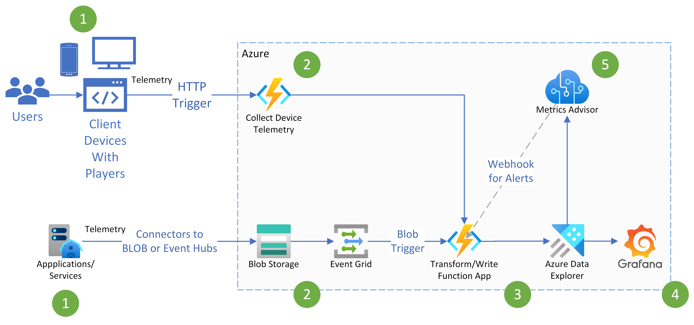

# Overview

This Repo contains a sample application building real-time monitoring and observability systems for media. Read the Article [Realtime Monitoring and Observability for Media](./docs/Realtime%20Monitoring%20and%20Observable%20System%20for%20Media.docx)

## Architecture

### Step by Step Guide

a. Infrastructure Deployment and Configuration. See [Infrastructure Deployment](./docs/1_infrastrucutre_deployment_configuration.md)
b. Local Development Setup. See [Local Development Setup](./docs/2_local_development_setup.md)
c. Extend Transformation Logic. See [Customize Transformation Logic Guide](./docs/3_extending_transformation_logic.md)
d. Types of Function Triggers. See [Function Triggers](./docs/4_function_triggers.md)
e. Metrics Advisor Setup. See [Metrics Advisor Setup](./docs/5_metrics_advisor_setup.md)
f. Running Tests Locally. See [Running Tests](./docs/6_running_tests_locally.md)