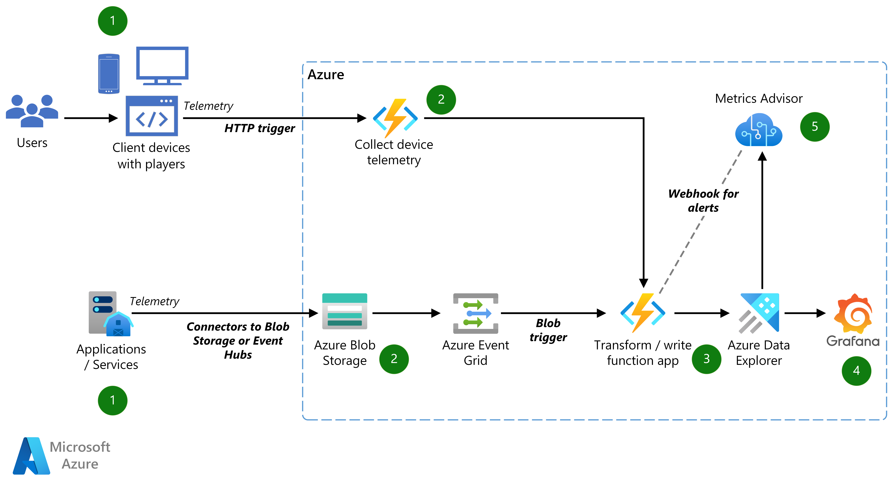

# Overview

This code sample is a supplement to [Building real-time monitoring and observable systems for Media](http://microsoft.com/) architecture and highlights a use case in the Media industry for providing real-time monitoring and observability of systems and end-user device telemetry.

This code sample includes the necessary Infrastructure-as-Code (IaC) to bootstrap development as well as Azure Functions to ingest and transform the data from HTTP and Blob endpoints.

## Architecture

*Note: This architecture deviates from the Azure Architecture Center article in that the Event Hubs ingestion service is not implemented.*

## Getting Started

1. [Infrastructure Deployment and Configuration](./docs/1_infrastrucutre_deployment_configuration.md)
2. [Local Development Setup](./docs/2_local_development_setup.md)
3. [Extending and Customizing Transformation Logic](./docs/3_extending_transformation_logic.md)
4. [Function Trigger Types](./docs/4_function_triggers.md)
5. [Metrics Advisor Setup](./docs/5_metrics_advisor_setup.md)
6. [Running Tests Locally](./docs/6_running_tests_locally.md)

## Contributing

This project welcomes contributions and suggestions. Most contributions require you to agree to a Contributor License Agreement (CLA) declaring that you have the right to, and actually do, grant us the rights to use your contribution. For details, visit https://cla.opensource.microsoft.com

To contribute, please start by creating a self-assigned [**issue**](https://github.com/Azure-Samples/real-time-monitoring-and-observability-for-media/issues/new) giving a high-level overview of what you'd like to do. Once any discussion there concludes, follow up with a PR.

This project has adopted the Microsoft Open Source Code of Conduct. For more information see the Code of Conduct FAQ or contact opencode@microsoft.com with any additional questions or comments.
