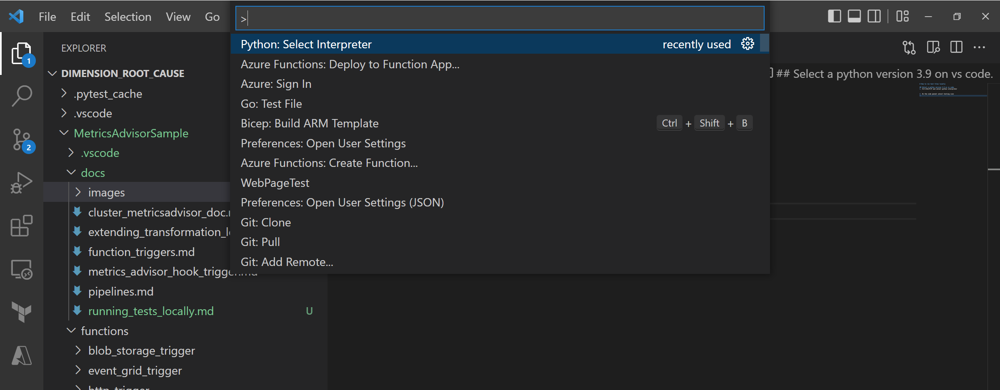
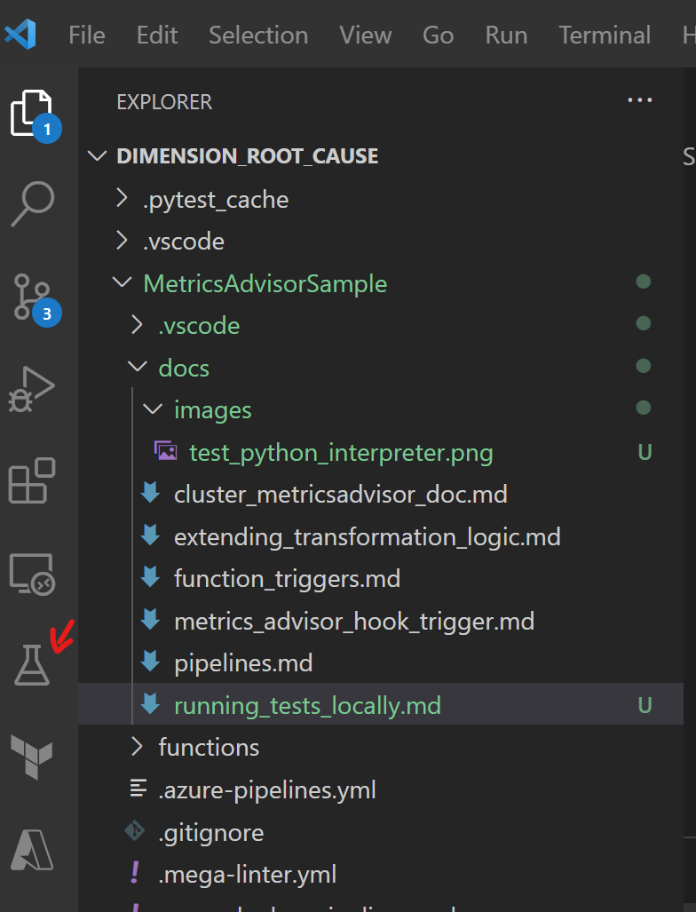
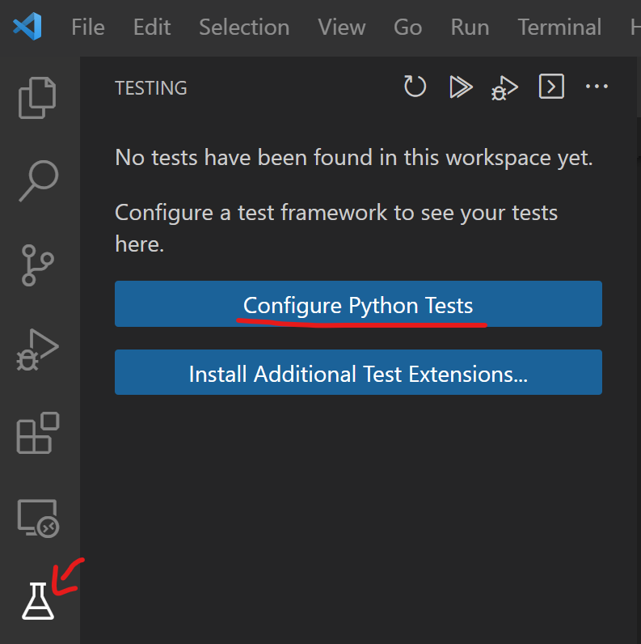
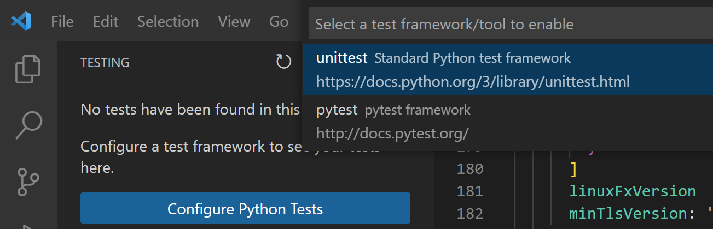
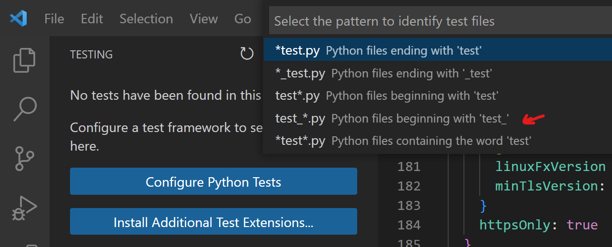

# How to run test files locally

## Ctrl+Shift+P and Select a python version 3.9 on vs code

1. Ctrl+Shift+P and select python interpreter

   

2. On the side pannel select testing icon

   

3. Complete the configuration on the side pannel. Ensure testing files have the test\_ prefixes

   

4. Select Unit Test option

   

5. Ensure to choose the right prefix for the test files. In our case, files used test\_\* prefix

   
